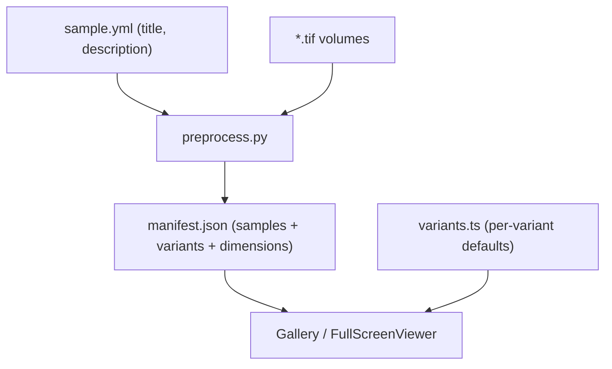

# Food Microstructure — 3D Atlas

A curated collection of high-resolution 3D reconstructions of food
microstructure captured with micro-CT and microscopy.

The site renders each sample as an interactive volume directly in the browser:
the raw voxel data is fetched, decompressed client-side, and uploaded to the GPU
as a `THREE.Data3DTexture`, so visitors can rotate, slice, and recolor the
volumes without any server-side rendering. Each sample exposes multiple
variants (raw, segmented, skeleton) that can be explored in a full-screen
viewer.

## Data flow



Each sample is a folder under `data/` holding its volumes and a `sample.yml`.
`preprocess.py` compresses the volumes and writes `manifest.json`, which the
gallery reads at runtime; the render configuration for each variant type comes
from the global defaults in `src/data/variants.ts`.

## Tech stack

- [Astro](https://astro.build) — static site framework and build tooling
- [React](https://react.dev) — interactive components (gallery, viewers)
- [Tailwind CSS](https://tailwindcss.com) — styling
- [three.js](https://threejs.org) — WebGL volume rendering
- [fzstd](https://github.com/101arrowz/fzstd) — client-side zstd decompression

## Prerequisites

- [Node.js](https://nodejs.org) >= 22.12.0
- [pnpm](https://pnpm.io) (the project pins `pnpm@11.17.0` via `packageManager`)
- [Conda](https://docs.conda.io) / [Miniconda](https://docs.conda.io/en/latest/miniconda.html)
  — only needed for image preprocessing

## Preprocessing the images

The source volumes are multi-page 8-bit TIFF z-stacks. Preprocessing turns them
into zstd-compressed raw binary volumes that the browser can fetch and upload
straight to the GPU, and records each volume's dimensions in a manifest.

### 1. Install conda

The preprocessing step needs [Conda](https://docs.conda.io) on your `PATH`. The
`3D_showcase` environment — declared in `preprocessing/environment.yml` with
`numpy`, `tifffile`, `imagecodecs`, `joblib`, and `pyyaml` — is created and kept
in sync automatically when you run the pipeline, so you don't need to create it
by hand.

### 2. Add the raw volumes

Place each sample in its own folder under `data/`, named after its original
(raw) volume. Each folder must contain a `sample.yml` with the sample's
`title` and `description`; the scripts discover folders automatically:

```text
data/<sample>/
    sample.yml       # required: title + description
    raw.tif          # required: original volume
    segmented.tif    # optional variant
    skeleton.tif     # optional variant
```

```yaml
# data/<sample>/sample.yml
title: WPI 0.05% GG
description: Acid-induced composite gel (3% w/w WPI, 0.05% w/w GG).
```

The variant type is the source file's stem (e.g. `raw.tif` -> `raw`), which
the viewer maps to a global render configuration defined in
`src/data/variants.ts`. Adding a sample therefore only requires the volumes and
`sample.yml` — no frontend changes.

> Note: `*.tif` files are git-ignored, so raw and intermediate volumes are not
> committed. Only the generated `public/volumes/**/*.raw.zst` files are tracked.

### 3. Run the pipeline

```sh
pnpm preprocess
```

This runs `preprocessing/run-preprocess.ts`, which:

1. Verifies conda is available, stopping with an error if it isn't.
2. Creates the `3D_showcase` environment from `preprocessing/environment.yml`,
   or updates it if any declared dependency is missing.
3. Runs `preprocessing/preprocess.py` inside that environment.

`preprocess.py` reads every `.tif` directly from `data/` and writes a
slice-major `*.raw.zst` file under `public/volumes/<sample>/`, mirroring the
input folder name, using zstd's maximum compression level. It then writes
`manifest.json`, which groups each sample's volumes and records their
`{width, height, depth}` alongside the sample's title and description. There is
no intermediate compressed-TIFF step.

Volumes whose `.raw.zst` output already exists are skipped, reusing their
existing manifest entry. The `preprocess` npm script passes `--skip-existing`,
so `pnpm preprocess` skips them by default; run
`pnpm preprocess -- --no-skip-existing` to force a full re-run (e.g. after
changing a source `.tif`).

- Analog volumes (anything that is not a binary mask, e.g. the raw original)
  are downsampled by 2× on every axis (area-averaged). Downsampling is required
  to keep the volume within the browser's ~100 MB budget.
- Binary volumes (segmented/skeleton) are kept at full resolution.

The script verifies each output (round-trip check) and exits non-zero on
failure.

### 4. Register the sample

Nothing else to do: the gallery reads the generated `manifest.json` at runtime,
so a sample appears as soon as its volumes and `sample.yml` are preprocessed.
Dimensions and the sample's title/description come from the manifest, and the
render configuration from the global per-variant defaults in
`src/data/variants.ts`.

## Building the website

Install dependencies and build the production site to `./dist/`:

```sh
pnpm install
pnpm build
```

Preview the production build locally:

```sh
pnpm preview
```

### Development server

Start the dev server (background mode is recommended, per `AGENTS.md`):

```sh
astro dev --background
```

Manage it with `astro dev stop`, `astro dev status`, and `astro dev logs`. The
dev server runs at `http://localhost:4321`.

## Deployment

The site is deployed to **GitHub Pages** via GitHub Actions. The workflow at
`.github/workflows/deploy.yml` runs on every push to `main` (and can be
triggered manually from the Actions tab):

1. **build** — checks out the repo and runs `withastro/action`, which installs
   dependencies, builds the site, and uploads the artifact.
2. **deploy** — publishes the artifact to GitHub Pages using
   `actions/deploy-pages`.

The deployment target is configured in `astro.config.mjs`:

```js
site: "https://ria-cat.github.io",
base: "/3D-food-microstructure",
```

Because the site is served from a sub-path, public asset URLs are prefixed with
the configured `base` at runtime (see `src/lib/volumes.ts`).

To deploy, simply commit and push to `main`:

```sh
git push origin main
```

Make sure the generated `public/volumes/**/*.raw.zst` files and `manifest.json`
are committed, since the build does not run the Python preprocessing pipeline.
